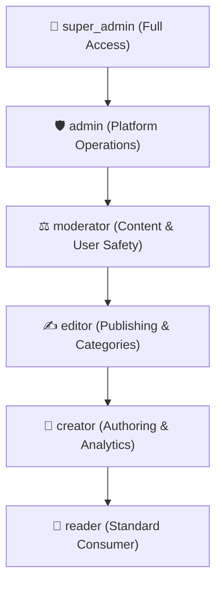

# ⚡ HyperNews — Enterprise Full-Stack News & Engagement Platform

> High-performance, scalable news aggregation, editorial moderation, and gamified engagement platform built with **FastAPI**, **React (Vite)**, **PostgreSQL (Railway)**, **SQLite**, **Redis**, and **Celery**.

[](https://fastapi.tiangolo.com/)
[](https://react.dev/)
[](https://railway.app/)
[](https://www.python.org/)
[](LICENSE)

---

## 📖 Table of Contents

- [Overview](#-overview)
- [System Architecture](#-system-architecture)
- [Key Features](#-key-features)
  - [Backend Services](#backend-services)
  - [Admin Portal](#admin-portal)
- [Tech Stack](#-tech-stack)
- [Database Setup](#-database-setup-railway-postgres--sqlite)
- [Quick Start](#-quick-start)
  - [1. One-Click Full-Stack Launcher (Windows)](#1-one-click-full-stack-launcher-windows)
  - [2. Manual Setup (Backend & Admin Portal)](#2-manual-setup)
- [Admin Portal Views & Capabilities](#-admin-portal-views--capabilities)
- [Role-Based Access Control (RBAC)](#-role-based-access-control-rbac)
- [Environment Configuration](#-environment-configuration)
- [API Documentation](#-api-documentation)
- [Testing](#-testing)
- [Deployment & Production](#-deployment--production)
- [Contributing & Repository](#-contributing--repository)

---

## 🌟 Overview

**HyperNews** is a production-ready news publishing and discovery platform engineered for high concurrency and real-time engagement. It integrates:
1. **Asynchronous FastAPI Core**: Powers article publishing, personalized feeds, vertical video reels ("shorts"), automated duplicate detection, sponsored ad delivery, and gamified rewards.
2. **Modern React Admin Portal**: A responsive administration and moderation dashboard built with Vite, Tailwind CSS / Vanilla tokens, Lucide icons, and JWT authentication.
3. **Hybrid Database Architecture**: Runs directly on **PostgreSQL on Railway** in production while seamlessly supporting local **SQLite** for zero-dependency development.

---

## 📂 System Architecture

```
HyperNews/
├── admin-portal/               # Modern React + Vite Admin Dashboard
│   ├── src/
│   │   ├── api/client.js       # Central API client with JWT bearer tokens
│   │   ├── components/         # Shared UI: Header, Sidebar, Modal, StatsCards
│   │   ├── context/            # AuthContext & ToastContext
│   │   └── views/              # 16+ Modular administrative views
│   ├── package.json            # Frontend dependencies & scripts
│   └── vite.config.js          # Vite bundler configuration
│
├── alembic/                    # Database migrations
│   └── versions/               # Production upgrade revisions (RBAC, Ads, Duplicates)
├── auth/                       # Security, RBAC permissions, JWT & OAuth2
│   ├── dependencies.py         # FastAPI dependency injection & route guards
│   ├── jwt_handler.py          # Token encoding/decoding & rotation
│   └── rbac.py                 # Role hierarchy & permission registry
├── config/                     # Pydantic Settings & environment schemas
├── middleware/                 # Security headers, rate limiting & normalization
├── models/                     # SQLAlchemy ORM models (News, Users, Ads, Audit, etc.)
├── routes/                     # Modular API route controllers
│   ├── admin_routes.py         # Moderation, admin metrics, content review
│   ├── admin_settings_routes.py# Navigation, category ordering, platform settings
│   ├── news_routes.py          # News aggregation, publishing, search
│   ├── rewards_routes.py       # Coin rewards, daily streaks, withdrawals
│   ├── short_routes.py         # Vertical reels / short-form news
│   └── user_routes.py          # Profiles, followers, authentication
├── services/                   # Business domain services
│   ├── ad_service.py           # Ad delivery, impression/click tracking
│   ├── duplicate_detection_service.py # Smart similarity matching & deduplication
│   ├── ranking_service.py      # Personalized feed scoring & trending algorithms
│   └── ingestion_service.py    # RSS & automated news ingestion
├── tests/                      # Automated test suite (Pytest + AsyncIO)
├── .env.example                # Sample environment configuration
├── database.py                 # SQLAlchemy engine, QueuePool, and sessionmaker
├── main.py                     # FastAPI application factory
├── requirements.txt            # Python dependencies
├── start.bat                   # Full-stack automated launcher script
└── test_debug.bat              # Debug launcher
```

---

## ✨ Key Features

### Backend Services
- **📰 Editorial News Engine**: Article drafting, scheduled publishing, rich categorization, tags, and multi-language support.
- **🔍 Intelligent Duplicate Detection**: Levenshtein distance, token similarity, and title hash checks prevent repetitive news ingestion.
- **📈 Algorithmic Feed Ranking**: Personalized content weighting using freshness, user interests, bookmarks, shares, and engagement velocity.
- **📱 HyperNews Shorts**: Short-form video reels with engagement counters, bookmarks, and optimized streaming endpoints.
- **📢 Native Ads & Monetization**: Banner & interstitial campaigns, CPM/CPC tracking, audience targeting, and frequency capping.
- **🎁 Gamification & Rewards**: Read-to-earn & share-to-earn points, daily login streaks, referral payouts, and automated withdrawal processing.
- **🛡️ Enterprise RBAC**: Role-based access control with granular permission checks across 6 user tiers.
- **🔒 Security Middlewares**: Sliding-window rate limiters (Redis or in-memory), HTTP security headers, CORS guards, and SQL query normalization.

### Admin Portal
- **⚡ Fast & Modern**: Built with React 19 and Vite with zero lag, instant search, and real-time metric updates.
- **📊 Executive Dashboard**: High-level KPIs, system health indicators, live user counts, and quick actions.
- **🛡️ Moderation Center**: Flagged comments and reports workflow, user suspension/ban triggers, and automated review queues.
- **👥 Role & User Directory**: Searchable user lists, dynamic role assignments, and permission inspection.
- **📍 Location Hierarchy**: Country, State, District, and City management for hyper-local geo-targeted news.
- **⚙️ Custom Layout Engine**: Manage dynamic navigation menus, categories, quick links, and footer links directly from the UI.

---

## 🛠️ Tech Stack

| Domain | Technology | Description |
|---|---|---|
| **Backend Framework** | [FastAPI](https://fastapi.tiangolo.com/) | Asynchronous, Python 3.10+ web framework |
| **Admin UI Framework** | [React](https://react.dev/) + [Vite](https://vitejs.dev/) | High-speed single-page application |
| **ORM & Migrations** | [SQLAlchemy 2.0](https://www.sqlalchemy.org/) + [Alembic](https://alembic.sqlalchemy.org/) | Type-safe queries, pooling, schema versions |
| **Primary Database** | [PostgreSQL (Railway)](https://railway.app/) | Managed high-performance production DB |
| **Development Database**| [SQLite](https://www.sqlite.org/) | In-memory and local file database fallback |
| **Caching & Throttling**| [Redis](https://redis.io/) | Distributed session caching & rate limiting |
| **Async Tasks & Jobs** | [APScheduler](https://apscheduler.readthedocs.io/) & [Celery](https://docs.celeryq.dev/) | Scheduled cleanup, publisher tasks, background queues |
| **AI Integration** | [Google Gemini AI](https://ai.google.dev/) | Summaries, category suggestions, keyphrase tags |
| **Notifications** | [Firebase Admin SDK](https://firebase.google.com/) | Push notifications via FCM |

---

## 🗄️ Database Setup (Railway Postgres & SQLite)

The platform features an intelligent dual-database resolver in [`database.py`](file:///d:/1%20no1/HyperNews/database.py):

* **Production (PostgreSQL via Railway)**:
  Configured in `.env` via `DATABASE_URL`:
  ```env
  ENVIRONMENT=production
  DATABASE_URL=postgresql://postgres:[PASSWORD]@[HOST]:[PORT]/railway
  ```
  Uses `QueuePool` with connection pooling, pre-ping validation, and recycled connections.
* **Development (SQLite Fallback)**:
  When `DATABASE_URL` is omitted and `ENVIRONMENT=development`, the system defaults to:
  ```env
  DATABASE_URL=sqlite:///./hypernews_dev.db
  ```

Run schema migrations anytime with:
```bash
alembic upgrade head
```

---

## 🚀 Quick Start

### 1. One-Click Full-Stack Launcher (Windows)

Use the built-in [`start.bat`](file:///d:/1%20no1/HyperNews/start.bat) control script:

```cmd
:: Launch both FastAPI Backend and React Admin Portal
start.bat run

:: Other useful commands:
start.bat install     :: Installs backend (.venv) and frontend (npm) dependencies
start.bat status      :: Check port status for 8000 and 5173
start.bat stop        :: Stop all running HyperNews processes
start.bat restart     :: Stop and re-launch both services
start.bat run backend :: Start only the FastAPI backend (Port 8000)
start.bat run frontend:: Start only the React Admin Portal (Port 5173)
```

Once started:
- **Admin Portal UI**: [http://localhost:5173](http://localhost:5173)
- **FastAPI API**: [http://127.0.0.1:8000](http://127.0.0.1:8000)
- **Interactive Swagger Docs**: [http://127.0.0.1:8000/docs](http://127.0.0.1:8000/docs)

---

### 2. Manual Setup

#### Step 1: Clone Repository
```bash
git clone https://github.com/RoshithNoorbasha/HyperNews.git
cd HyperNews
```

#### Step 2: Configure Backend
```bash
# Create virtual environment
python -m venv .venv

# Activate virtual environment
# Windows:
.venv\Scripts\activate
# Linux/macOS:
source .venv/bin/activate

# Install dependencies
pip install -r requirements.txt

# Create environment configuration
copy .env.example .env  # On Linux/macOS use: cp .env.example .env

# Run database migrations
alembic upgrade head

# Start FastAPI backend
python main.py
```

#### Step 3: Configure Admin Portal
In a new terminal window:
```bash
cd admin-portal

# Install NPM dependencies
npm install

# Start development server
npm run dev
```

---

## 🖥️ Admin Portal Views & Capabilities

The Admin Portal includes dedicated management panels accessible from the sidebar:

| View | Purpose |
|---|---|
| **📊 Dashboard** | Executive summary: real-time visitors, active articles, flagged items, and revenue. |
| **📰 News Management** | Create, edit, approve, filter, and schedule news articles. |
| **🛡️ Enterprise Moderation** | Review reported comments, suspend malicious users, and view audit history. |
| **👥 User Management** | Manage roles, inspect user profiles, verify creators, and review coin balances. |
| **📢 Ads Management** | Monitor campaigns, impressions, CTR, placements, and payout calculations. |
| **🎁 Rewards & Withdrawals** | Review user coin-to-cash withdrawal requests, approve/reject transactions. |
| **📍 Location Management** | Manage hierarchical regional taxonomy (Countries, States, Districts, Cities). |
| **📊 Analytics** | Platform traffic, content engagement velocity, top performing authors, and categories. |
| **⚙️ System Settings** | Configure dynamic site navigation, banner alerts, social links, and SEO defaults. |

---

## 🔐 Role-Based Access Control (RBAC)

The system enforces strict RBAC permissions across all endpoints:



Permissions are enforced via FastAPI dependencies:
```python
from auth.rbac import require_permission, Permission

@router.delete("/news/{news_id}")
async def delete_article(
    news_id: int, 
    user: User = Depends(require_permission(Permission.DELETE_NEWS))
):
    ...
```

---

## ⚙️ Environment Configuration

Key configuration parameters inside `.env`:

```env
# Server
ENVIRONMENT=production
DEBUG=False
PORT=8000

# Database (PostgreSQL Railway or SQLite)
DATABASE_URL=postgresql://postgres:[PASSWORD]@[HOST]:[PORT]/railway

# Security & Tokens
SECRET_KEY=your-256-bit-secret-key-here
SESSION_SECRET_KEY=your-session-encryption-key-here
ACCESS_TOKEN_EXPIRE_MINUTES=60000

# CORS
CORS_ALLOW_ORIGINS=https://hypernews-production.up.railway.app,http://localhost:5173,http://localhost:3000

# Google OAuth (Optional)
GOOGLE_CLIENT_ID=your-google-client-id
GOOGLE_CLIENT_SECRET=your-google-client-secret

# Email & SMS (Brevo)
BREVO_API_KEY=your-brevo-api-key
BREVO_SENDER_EMAIL=noreply@whispry.in
```

---

## 📚 API Documentation

FastAPI auto-generates interactive OpenAPI specifications:

- **Swagger UI**: [http://127.0.0.1:8000/docs](http://127.0.0.1:8000/docs)
- **ReDoc**: [http://127.0.0.1:8000/redoc](http://127.0.0.1:8000/redoc)
- **OpenAPI Schema**: [http://127.0.0.1:8000/openapi.json](http://127.0.0.1:8000/openapi.json)

---

## 🧪 Testing

Run the automated test suite with `pytest`:

```bash
# Run all tests
pytest tests/

# Run with test coverage
pytest --cov=. --cov-report=term-missing
```

The test suite covers:
- **Authentication & JWT Validation** (`tests/test_auth.py`)
- **Role-Based Access Control** (`tests/test_rbac.py`)
- **Duplicate Detection Logic** (`tests/test_duplicate_detection.py`)
- **Feed Generation & Monetization Ads** (`tests/test_feed_and_monetization.py`)
- **Algorithmic Ranking** (`tests/test_ranking.py`)
- **Security Middlewares & Health Checks** (`tests/test_security_and_health.py`)

---

## 🚢 Deployment & Production

### Docker Compose
Run the API with PostgreSQL and Redis containers:
```bash
docker-compose up -d --build
```

### Production Checklist
1. Ensure `ENVIRONMENT=production` and `DEBUG=False`.
2. Generate strong, unique values for `SECRET_KEY` and `SESSION_SECRET_KEY`.
3. Set `CORS_ALLOW_ORIGINS` to your production frontend domain(s).
4. Run `alembic upgrade head` on the target database before serving traffic.

---

## 🤝 Contributing & Repository

- **Repository**: [https://github.com/RoshithNoorbasha/HyperNews](https://github.com/RoshithNoorbasha/HyperNews)
- **Branches**:
  - `main`: Production-ready release branch.
  - `Whispry-ai`: Feature development & integration branch.

---

## 📄 License

This project is licensed under the MIT License — see the repository for full details.
