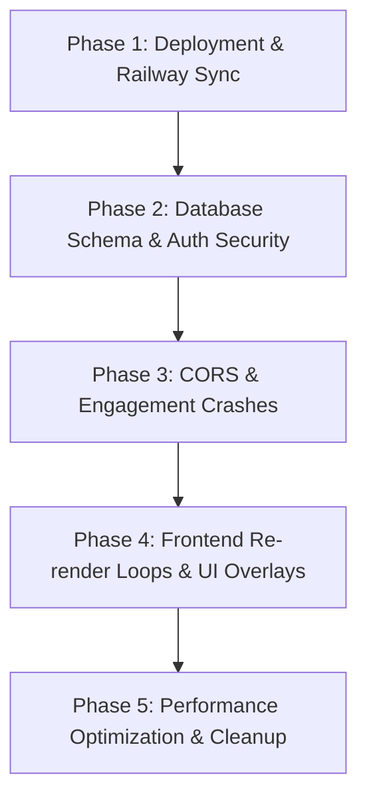

# City News Telugu: Full Technical Audit Report

**Date:** October 8, 2026  
**Audited Repositories:**
- **Frontend:** `PushkarKunda/City-News-Telugu` (Expo SDK 52, React Native 0.76.9, Zustand 5, TanStack Query 5)
- **Backend:** `PushkarKunda/HyperNews-Backend` & `RoshithNoorbasha/HyperNews` (FastAPI, SQLAlchemy, PostgreSQL, Railway Deploy: `hypernews-production.up.railway.app`)

---

## 1. Executive Summary Table

| # | Severity | Area | Repository | File & Line | Issue Summary | Status |
|---|---|---|---|---|---|---|
| **1** | **CRITICAL** | Deployment / Backend | `HyperNews-Backend` | `database.py:95-115` | Production DB early returns before `ensure_user_columns()`; Google auth DB columns missing in production. | **Confirmed** |
| **2** | **CRITICAL** | Deployment / Auth | Production Live API | Railway Deployment Source | Railway is deploying an outdated commit (`39e427d` or earlier) from `RoshithNoorbasha/HyperNews`; all Google Auth endpoints return 404 in production. | **Confirmed** |
| **3** | **CRITICAL** | Security / Auth | `HyperNews-Backend` | `routes/user_routes.py:915-920`, `login1:407-410` | Account Takeover vulnerability: `sync_provider` & `firebase_login` link existing accounts by email without verifying `email_verified == True`. | **Confirmed** |
| **4** | **CRITICAL** | Security / Signing | `City-News-Telugu` | `android/app/build.gradle:112` | Release APK builds are signed with `signingConfigs.debug` using the committed debug keystore. | **Confirmed** |
| **5** | **HIGH** | CORS / Network | `HyperNews-Backend` | `main.py:168` | Production CORS `allowed_headers` whitelist omits `Idempotency-Key` and `X-Idempotency-Key`, causing preflight failure on web/mobile POSTs. | **Confirmed** |
| **6** | **HIGH** | Runtime / UI Loop | `City-News-Telugu` | `hooks/useHomeScreen.ts:258-292`, `ImmersiveNewsCard.tsx:186` | "Maximum update depth exceeded": `useHomeScreen` imperatively overwrites Query cache in `useEffect` with unstable object references while `ImmersiveNewsCard` mutates Zustand state during render. | **Confirmed** |
| **7** | **HIGH** | Engagement / DB | `HyperNews-Backend` | `routes/news_routes.py:2687-2695` | Double-tap like triggers unhandled SQLAlchemy `IntegrityError` 500 crash due to missing atomic `ON CONFLICT` / retry logic; no rate limiting. | **Confirmed** |
| **8** | **HIGH** | Engagement / Feed | `HyperNews-Backend` & Frontend | `news_routes.py:525-547, 3315`, `ImmersiveNewsCard.tsx:319` | `user_liked` is hardcoded to `False` in updates/publish routes, omitted from feed payloads, and UI card initializes state to `false`. | **Confirmed** |
| **9** | **HIGH** | Auth / Session | `City-News-Telugu` | `store/authStore.ts:418-423`, `app/_layout.tsx:168-171` | Stale session bug: Token expiry triggers silent `console.warn` without clearing auth state; unauthenticated store reads return ghost session. | **Confirmed** |
| **10** | **HIGH** | UI / Layout | `City-News-Telugu` | `app/(tabs)/posts.tsx:747`, `components/PostCard.tsx:813-860` | Floating `+` composer button at `bottom: contentBottomOffset, left: 18` directly overlays and blocks author avatar and follow button. | **Confirmed** |
| **11** | **MEDIUM** | Performance / API | `City-News-Telugu` | `app/(tabs)/shorts.tsx:285-315`, `app/(tabs)/posts.tsx:94-120` | Redundant network waterfall: Screens call aggregate endpoint (`/screens/shorts`, `/screens/community`) and simultaneously trigger individual hooks. | **Confirmed** |
| **12** | **MEDIUM** | Performance / DB | `HyperNews-Backend` | `routes/notification_routes.py:131`, `routes/news_routes.py:4746` | Unpaginated full table scans (`db.query(User).all()`, `query.order_by().all()`) causing memory spikes and high latency. | **Confirmed** |
| **13** | **MEDIUM** | Security / Secrets | `HyperNews-Backend` | `admin-portal/src/api/client.js:14`, `docker-compose.yml:19` | Committed default admin token and plain-text postgres credentials in repository. | **Confirmed** |
| **14** | **MEDIUM** | Error Handling | `City-News-Telugu` | `app/(auth)/login.tsx:56`, `profile.tsx:403`, `client.ts:180` | Raw `error.message` strings and Axios 500 exceptions shown to end users; telemetry routes suppress 401 token refresh cleanup. | **Confirmed** |
| **15** | **MEDIUM** | Runtime Warnings | `HyperNews-Backend` | `gemini_ai.py:1` | Deprecated Google Generative AI SDK logs `FutureWarning`: `google.generativeai` support ended; requires migration to `google.genai`. | **Confirmed** |
| **16** | **LOW** | Build / Tooling | `City-News-Telugu` | `package.json:43` | `expo-doctor` warning: `expo-modules-core` is explicitly listed as a dependency instead of being managed by `expo`. | **Confirmed** |
| **17** | **LOW** | Repo Hygiene | `City-News-Telugu` | Root workspace directory | Untracked repository clones and build artifacts present in local project root. | **Confirmed** |

---

## 2. Detailed Findings by Severity

### CRITICAL SEVERITY

#### Issue 1: Production DB Schema Bypasses Column Migrations
- **Repository:** `PushkarKunda/HyperNews-Backend`
- **File & Line:** `database.py:95-115`
- **What is wrong:**  
  `init_db()` contains the check `if _is_production: return`. The dynamic column migration function `ensure_user_columns()` is invoked *after* this early return. Furthermore, Alembic migration history in `alembic/versions` has no migration script adding `google_id`, `auth_provider`, `providers`, or `email_verified_at` to the `users` table.
- **Why it matters:**  
  Whenever production executes, `ensure_user_columns()` never runs. If the backend tries to query or insert these columns on Railway's PostgreSQL database, SQLAlchemy throws `UndefinedColumn: column "google_id" of relation "users" does not exist`, resulting in 500 Internal Server Error for every auth request.
- **Proposed Fix:**  
  1. Remove `if _is_production: return` from running safe schema alterations, or generate a formal Alembic migration script (`alembic revision --autogenerate -m "add_google_auth_columns"`).
  2. Run `alembic upgrade head` in Railway's release phase (`Procfile` / start command).
- **Effort:** Small

#### Issue 2: Live Railway Deployment Drift (Outdated Repo / Branch Deployed)
- **Repository:** Production Deployment (`hypernews-production.up.railway.app`) vs `PushkarKunda/HyperNews-Backend`
- **File & Line:** Railway Project Settings / GitHub Remote Link
- **What is wrong:**  
  Live inspection of `https://hypernews-production.up.railway.app/openapi.json` reveals exactly 340 paths, whereas the latest local backend has 346 paths. The live server responds with `404 Not Found` for:
  - `POST /user/auth/google`
  - `POST /user/auth/sync-provider`
  - `POST /auth/google`
  - `POST /auth/sync-provider`
  - `GET /user/publisher/status`  
  Railway is linked to `RoshithNoorbasha/HyperNews` (commit `39e427d` or older) instead of `PushkarKunda/HyperNews-Backend:main` (`00d955f`).
- **Why it matters:**  
  Any changes pushed to `PushkarKunda/HyperNews-Backend` or tests run against production fail because production is executing an obsolete codebase without the Google Sign-In or sync endpoints.
- **Proposed Fix:**  
  In the Railway project dashboard, switch the repository source from `RoshithNoorbasha/HyperNews` to `PushkarKunda/HyperNews-Backend`, branch `main`, and trigger a redeploy.
- **Effort:** Small (Administrative)

#### Issue 3: Pre-Authentication Account Takeover via Unverified Email Matching
- **Repository:** `PushkarKunda/HyperNews-Backend`
- **File & Line:** `routes/user_routes.py:915-920`, `routes/user_routes.py:407-410` (`login1`)
- **What is wrong:**  
  In `sync_provider`:
  ```python
  existing_user = db.query(User).filter(User.email == email).first()
  if existing_user:
      existing_user.google_id = google_id
      existing_user.auth_provider = "google"
  ```
  The endpoint extracts `email` from the provider payload and links it directly to an existing database user without asserting `email_verified == True` from Google/Firebase token claims.
- **Why it matters:**  
  An attacker can create a third-party account with a victim's email (if the provider doesn't enforce immediate verification) and call this endpoint to bind their own identity to the victim's account, achieving full account takeover.
- **Proposed Fix:**  
  Require verification:
  ```python
  if not provider_payload.get("email_verified"):
      raise HTTPException(status_code=400, detail="Provider email must be verified before account linking")
  ```
- **Effort:** Small

#### Issue 4: Release APK Signed with Debug Keystore
- **Repository:** `PushkarKunda/City-News-Telugu`
- **File & Line:** `hyperlocal-news-frontend/android/app/build.gradle:112`
- **What is wrong:**  
  In `buildTypes { release { ... } }`:
  ```groovy
  signingConfig signingConfigs.debug
  ```
  The production release build is configured to sign with the public `android/app/debug.keystore`.
- **Why it matters:**  
  1. Google Play Console rejects APK/AAB builds signed with a debug certificate.  
  2. Anyone with access to the repo can forge app updates or tamper with client builds.
- **Proposed Fix:**  
  Configure a separate `signingConfigs.release` referencing environment variables (`MYAPP_RELEASE_STORE_FILE`, `MYAPP_RELEASE_KEY_ALIAS`, `MYAPP_RELEASE_STORE_PASSWORD`), and only fall back to debug in non-production builds.
- **Effort:** Medium

---

### HIGH SEVERITY

#### Issue 5: Production CORS Whitelist Rejects Idempotency Headers
- **Repository:** `PushkarKunda/HyperNews-Backend`
- **File & Line:** `main.py:168`
- **What is wrong:**  
  In production mode, `CORSMiddleware` restricts `allow_headers` to:
  ```python
  allow_headers=["Content-Type", "Authorization", "Accept", "X-Request-ID"]
  ```
  It omits `Idempotency-Key` and `X-Idempotency-Key`.
- **Why it matters:**  
  The mobile client and web admin send `Idempotency-Key` on comment, like, and creation requests. The browser/HTTP client issues an `OPTIONS` preflight request; because the header is not in `allow_headers`, the preflight fails with HTTP 403/CORS policy violation, breaking user engagement requests.
- **Proposed Fix:**  
  Add `"Idempotency-Key"`, `"X-Idempotency-Key"`, and `"X-Client-Version"` to `allow_headers` in `main.py:168`.
- **Effort:** Small

#### Issue 6: "Maximum Update Depth Exceeded" in HomeScreen & ImmersiveNewsCard
- **Repository:** `PushkarKunda/City-News-Telugu`
- **File & Line:** `hooks/useHomeScreen.ts:258-292`, `components/ImmersiveNewsCard.tsx:186-195`
- **What is wrong:**  
  1. `useHomeScreen` has a `useEffect` that calls `queryClient.setQueryData(['news-feed', ...], ...)` with freshly mapped arrays and objects whenever `homeScreenData` changes. However, `useNewsFeed` also observes that same query key. The cache update triggers subscribers, which causes re-renders and re-triggers effect dependencies.  
  2. `ImmersiveNewsCard` calls `useCommentCountStore.getState().setInitialCount(...)` inside a `useEffect` on every card mount and prop change during FlatList layout.  
  3. Screens like `app/(tabs)/_layout.tsx:17` and `profile.tsx:45` call `useAuthStore()` (the full store object) rather than selector slices (`useAuthStore(s => s.user)`).
- **Why it matters:**  
  Triggers React warning: *"Maximum update depth exceeded. This can happen when a component repeatedly calls setState inside componentWillUpdate or componentDidUpdate."* Degrades framerate, stutters feed scrolling, and crashes on lower-end devices.
- **Proposed Fix:**  
  1. Remove imperative `queryClient.setQueryData` overwrites inside `useHomeScreen`'s render loop; let React Query manage hydration via `initialData` or standard query merging.  
  2. In `ImmersiveNewsCard`, seed comment counts during data normalization rather than in card lifecycle effects.  
  3. Replace whole-store subscriptions with selector slices across `TabBar`, `_layout.tsx`, and `profile.tsx`.
- **Effort:** Medium

#### Issue 7: Double-Tap Like Race Condition & Unhandled 500 Crash
- **Repository:** `PushkarKunda/HyperNews-Backend`
- **File & Line:** `routes/news_routes.py:2687-2695`
- **What is wrong:**  
  The like endpoint executes:
  ```python
  existing_reaction = db.query(NewsReaction).filter(...).first()
  if not existing_reaction:
      reaction = NewsReaction(...)
      db.add(reaction)
      db.commit()
  ```
  If a user double-taps quickly, two concurrent requests pass `if not existing_reaction`. Both execute `db.add()`, and the second raises `sqlalchemy.exc.IntegrityError: duplicate key value violates unique constraint "unique_news_user_reaction"`. The exception is unhandled and returns HTTP 500.
- **Why it matters:**  
  Double-tap to like is an advertised feature in the UI. Users frequently encounter sudden like failures and rollbacks when liking items.
- **Proposed Fix:**  
  Use `postgresql.insert(NewsReaction).on_conflict_do_nothing()` or wrap `db.commit()` in a `try...except IntegrityError: db.rollback()` block and return the current state gracefully.
- **Effort:** Small

#### Issue 8: News Feed Likes Hardcoded to False
- **Repository:** `PushkarKunda/HyperNews-Backend` & `City-News-Telugu`
- **File & Line:** `routes/news_routes.py:525-547, 3315, 4190`, `components/ImmersiveNewsCard.tsx:319`
- **What is wrong:**  
  1. In `news_routes.py:525-547` (`get_news_data`), `user_liked` is completely omitted from the feed serialization dictionary.  
  2. In lines 3315 and 4190, the backend explicitly returns `"user_liked": False`.  
  3. In `ImmersiveNewsCard.tsx:319`, the card initializes like state as:  
     `const [liked, setLiked] = React.useState(false);`  
     ignoring `item.user_liked` or cache state.
- **Why it matters:**  
  Articles that a user has already liked appear unliked whenever the feed refreshes.
- **Proposed Fix:**  
  1. Include `user_liked` in `get_news_data` by checking user reactions if `current_user` is present in request context.  
  2. In `ImmersiveNewsCard.tsx`, initialize `useState(Boolean(item.user_liked || item.is_liked))`.
- **Effort:** Small

#### Issue 9: Token Refresh Failure Leaves Ghost Authenticated State
- **Repository:** `PushkarKunda/City-News-Telugu`
- **File & Line:** `store/authStore.ts:418-423`, `app/_layout.tsx:168-171`
- **What is wrong:**  
  In `app/_layout.tsx`:
  ```typescript
  setOnUnauthorizedCallback(() => {
    console.warn('🔓 Token expired - handled silently without disrupting active session');
  });
  ```
  When token refresh fails, `authStore` does not reset `isAuthenticated: false` or clear `user`.
- **Why it matters:**  
  The UI believes the user is logged in, but all API calls fail with 401 Unauthorized. Forms and feeds display permanent error indicators, and users cannot log out or re-authenticate without manually clearing app storage.
- **Proposed Fix:**  
  In `_layout.tsx`, invoke `useAuthStore.getState().logout()` or prompt a re-login modal when unauthorized callback triggers.
- **Effort:** Small

#### Issue 10: Floating Action Button (+) Directly Overlays Post Author Header
- **Repository:** `PushkarKunda/City-News-Telugu`
- **File & Line:** `app/(tabs)/posts.tsx:747`, `components/PostCard.tsx:813-860`
- **What is wrong:**  
  In `posts.tsx`:
  `styles.floatingComposerButton` is pinned to `bottom: contentBottomOffset, left: 18`.  
  In `PostCard.tsx`:
  `styles.bottomLeftOverlay` is pinned to `bottom: bottomOffset, left: 16`, which contains `authorRow` (avatar, name, follow button).
- **Why it matters:**  
  The 56x56px circular floating compose button sits directly on top of the post author's profile avatar and follow button. Users cannot tap the author or follow button without triggering post composition.
- **Proposed Fix:**  
  Move the composer trigger to the top navigation header beside the search icon, or relocate it to a dedicated non-conflicting position.
- **Effort:** Small

---

### MEDIUM SEVERITY

#### Issue 11: Redundant Network Waterfall on Shorts and Community Feeds
- **Repository:** `PushkarKunda/City-News-Telugu`
- **File & Line:** `app/(tabs)/shorts.tsx:285-315`, `app/(tabs)/posts.tsx:94-120`
- **What is wrong:**  
  `shorts.tsx` calls `useShortsScreen({ language: 'te' })` (aggregate endpoint), but immediately below also calls `useNewsShorts('te')` AND `contentApi.getActiveAdvertisements()`. `shortsFeed` uses the individual hooks, rendering the aggregate call completely redundant. The same pattern occurs in `posts.tsx` with `useCommunityScreen` and `useInfinitePublicPostsFeed`.
- **Why it matters:**  
  Multiplies network bandwidth consumption and backend load by 3x on every screen transition.
- **Proposed Fix:**  
  Consume data directly from the aggregate screen hooks, removing the duplicate individual queries.
- **Effort:** Small

#### Issue 12: Unpaginated Database Queries in Production Routes
- **Repository:** `PushkarKunda/HyperNews-Backend`
- **File & Line:** `routes/notification_routes.py:131`, `routes/news_routes.py:4746`
- **What is wrong:**  
  Queries such as `db.query(User).filter(User.is_suspended == False).all()` and `query.order_by(desc(News.created_at)).all()` execute without `.limit()` or `.offset()`.
- **Why it matters:**  
  As user and article tables scale into tens of thousands of rows, these queries will exhaust backend container memory, leading to Railway OOM crashes.
- **Proposed Fix:**  
  Apply strict chunking/batching (e.g. `yield_per(500)`) for background jobs and enforce mandatory `.limit()` pagination on public endpoints.
- **Effort:** Medium

#### Issue 13: Hardcoded Admin Tokens and Database Credentials
- **Repository:** `PushkarKunda/HyperNews-Backend`
- **File & Line:** `admin-portal/src/api/client.js:14`, `docker-compose.yml:19`
- **What is wrong:**  
  `DEFAULT_DEV_ADMIN_TOKEN = "dev-admin-token-super-secret-change-in-production"` is hardcoded in the admin portal client, and `POSTGRES_PASSWORD=postgres` is hardcoded in `docker-compose.yml`.
- **Why it matters:**  
  Exposes the development admin interface and default PostgreSQL credentials if instances are deployed with default environment variables.
- **Proposed Fix:**  
  Remove hardcoded fallback tokens; throw an error if `REACT_APP_ADMIN_TOKEN` or `POSTGRES_PASSWORD` is not explicitly set in the environment.
- **Effort:** Small

#### Issue 14: Raw Technical Errors Exposed to End Users
- **Repository:** `PushkarKunda/City-News-Telugu`
- **File & Line:** `app/(auth)/login.tsx:56`, `app/(tabs)/profile.tsx:403`
- **What is wrong:**  
  Alerts display `error.message` verbatim (e.g., `Request failed with status code 500`).
- **Why it matters:**  
  Poor user experience and potential leakage of backend endpoint structure or database errors to end users.
- **Proposed Fix:**  
  Route error reporting through a user-friendly translation helper that displays clear messages (e.g., "Unable to sign in right now. Please try again.").
- **Effort:** Small

#### Issue 15: Deprecated Gemini SDK Warning on Startup
- **Repository:** `PushkarKunda/HyperNews-Backend`
- **File & Line:** `gemini_ai.py:1`
- **What is wrong:**  
  Import of `google.generativeai` triggers a `FutureWarning`: all support for `google.generativeai` has moved to `google.genai`.
- **Why it matters:**  
  The legacy SDK will stop receiving security updates and may break when Google sunsets legacy endpoints.
- **Proposed Fix:**  
  Migrate imports and method calls to `from google import genai`.
- **Effort:** Medium

---

### LOW SEVERITY

#### Issue 16: `expo-modules-core` Dependency Warning in Expo Doctor
- **Repository:** `PushkarKunda/City-News-Telugu`
- **File & Line:** `hyperlocal-news-frontend/package.json:43`
- **What is wrong:**  
  `expo-doctor` reports: *"expo-modules-core should not be listed in package.json dependencies"*.
- **Why it matters:**  
  Can cause peer dependency version conflicts during `npm install` and Expo SDK upgrades.
- **Proposed Fix:**  
  Remove `"expo-modules-core": "2.2.3"` from `dependencies` in `package.json`.
- **Effort:** Small

#### Issue 17: Local Workspace Repository Hygiene & Untracked Directories
- **Repository:** `PushkarKunda/City-News-Telugu`
- **File & Line:** Root workspace
- **What is wrong:**  
  Untracked `backend/` directory present in the root of the frontend repository.
- **Why it matters:**  
  Risks accidentally committing backend files or credentials into the frontend repository.
- **Proposed Fix:**  
  Add `backend/` to `.gitignore` or maintain separate root workspaces.
- **Effort:** Small

---

## 3. Recommended Fix Order



1. **Phase 1: Deployment & Railway Sync (Immediate)**
   - Link Railway to `PushkarKunda/HyperNews-Backend` (`main` branch) to deploy current endpoints.
   - Verify environment variables on Railway (`SECRET_KEY`, `DATABASE_URL`, `FIREBASE_CREDENTIALS`).

2. **Phase 2: Database Schema & Auth Security**
   - Create and run the Alembic migration for `users` table columns (`google_id`, `auth_provider`, `providers`, `email_verified_at`).
   - Add `email_verified` check to `routes/user_routes.py:915` (`sync_provider`) to prevent account takeover.
   - Fix release keystore configuration in `android/app/build.gradle:112`.

3. **Phase 3: CORS & Engagement Crashes**
   - Add `Idempotency-Key` and `X-Idempotency-Key` to CORS `allow_headers` in `main.py:168`.
   - Update `news_routes.py:2687` like handler with `ON CONFLICT DO NOTHING` / `try...except IntegrityError`.
   - Populate `user_liked` in `get_news_data` and read it in `ImmersiveNewsCard.tsx`.

4. **Phase 4: Frontend Re-render Loops & UI Layout**
   - Eliminate circular cache updates in `hooks/useHomeScreen.ts` and `ImmersiveNewsCard.tsx`.
   - Move the floating compose button in `posts.tsx` away from the author profile avatar.
   - Connect `setOnUnauthorizedCallback` in `_layout.tsx` to clear auth state and prompt login.

5. **Phase 5: Performance Optimization & Cleanup**
   - Remove duplicate queries in `shorts.tsx` and `posts.tsx` (rely exclusively on aggregate hooks).
   - Add limits to unpaginated queries in `notification_routes.py` and `news_routes.py`.
   - Remove `expo-modules-core` from `package.json`.

---

## 4. Unverified Items (Tools / Access Required)

1. **Railway Project Dashboard Access:**  
   - *Status:* Inferred from public OpenAPI diff.
   - *Verification Needed:* Direct access to Railway dashboard to inspect build logs, linked GitHub repository, deployment webhooks, and active environment variables.
2. **Google Cloud / Firebase Console (OAuth Client IDs & SHA-1):**  
   - *Status:* Local `google-services.json` matches debug keystore SHA-1 (`5E:8F:16:06:2E:A3:CD:2C:4A:0D:54:78:76:BA:A6:F3:8C:AB:F6:25`).
   - *Verification Needed:* Access to Google Cloud Console to verify whether the release keystore SHA-1 is registered under Android OAuth 2.0 Client IDs.
3. **Physical iOS / Web Real Device Testing:**  
   - *Status:* Verified on Android Emulator (`emulator-5554`) and code analysis.
   - *Verification Needed:* Test gesture responsiveness, YouTube Shorts WebView unmuting, and safe area insets on physical iPhone devices and Web browsers.
